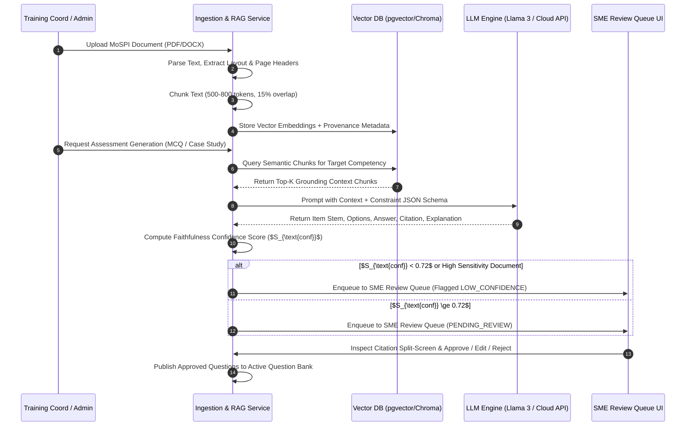

# System Architecture Specification
## AI-Enabled Adaptive Learning & Assessment Platform for India's Official Statistical System
**Problem Statement ID**: SIH26101 | **Ministry**: Ministry of Statistics and Programme Implementation (MoSPI)  
**Hackathon Target**: Smart India Hackathon (SIH) 2026 — National Level First Prize Strategy (₹5,00,000 Prize Pool)

---

## 1. Executive Vision & Hackathon Winning Strategy (Architect's POV)

To secure the **1st Prize at the National Level**, a hackathon platform cannot merely be a superficial UI wrapper over a basic LLM API. The hackathon jury (comprising MoSPI senior directors, government IT architects, and domain experts) will judge solutions on **five non-negotiable pillars**:

1. **Enterprise & Sovereign Cloud Feasibility**: Government data compliance requires zero leakage of unreleased statistical circulars or survey manuals. Our architecture features a **Dual-Mode AI Engine** supporting both cloud APIs (OpenAI/Anthropic/Groq for rapid prototyping) and **Air-Gapped Sovereign Local LLMs** (Llama-3-8B/70B via vLLM/Ollama on NIC MeghRaj cloud).
2. **AI Safety & RAG Triad Guardrails**: LLM hallucinations in statistical formulas or survey methodologies are fatal. We incorporate automated confidence scoring, context relevance checks, and mandatory **SME Human-in-the-Loop Review Queues** with exact document section/page citation traceability.
3. **Psychometric Rigor (IRT + CAT)**: Unlike simple score percentages, our diagnostic testing engine employs **Computerized Adaptive Testing (CAT)** based on **2-Parameter Logistic (2PL) Item Response Theory (IRT)** to dynamically measure an officer's true ability ($\theta$) across statistical competency frameworks.
4. **Seamless iGOT Karmayogi Ecosystem Integration**: Rather than attempting to replace government infrastructure, our platform functions as an intelligent force-multiplier. It interfaces with **iGOT Karmayogi** via REST/xAPI/SCORM adapters, transforming diagnostic skill-gap vectors into hyper-personalized course recommendations.
5. **National Scale & Real-Time Intelligence**: Designed for 50,000+ statistical officers across Central (NSSO, CSO), State (DES), and District tiers, backed by high-throughput FastAPI microservices, Redis session caching, PostgreSQL + pgvector, and sub-second WebSockets analytics heatmaps.

---

## 2. High-Level Architecture & System Context (C4 Model)

```
┌────────────────────────────────────────────────────────────────────────────────────────────────────────┐
│                                       USER ACCESS & PRESENTATION TIER                                  │
│                                                                                                        │
│   ┌───────────────────────┐   ┌───────────────────────┐   ┌───────────────────────┐   ┌──────────────┐ │
│   │   Statistical Officer │   │  Training Coordinator │   │   SME Reviewer UI     │   │ MoSPI HQ     │ │
│   │   (Learner Portal)    │   │  (Cohort Console)     │   │   (Citation Inspector)│   │ Admin Heatmap│ │
│   └───────────┬───────────┘   └───────────┬───────────┘   └───────────┬───────────┘   └──────┬───────┘ │
│               │                           │                           │                      │         │
│               └───────────────────────────┴─────────────┬─────────────┴──────────────────────┘         │
│                                                         │ Responsive Web (Next.js 14 App Router)        │
│                                                         │ i18n Localization (English / Hindi / Indic)   │
└─────────────────────────────────────────────────────────┼──────────────────────────────────────────────┘
                                                          │ HTTPS / REST / SSE / WebSockets
┌─────────────────────────────────────────────────────────▼──────────────────────────────────────────────┐
│                                           API GATEWAY & SECURITY LAYER                                 │
│                   OAuth2 / JWT Auth  •  Jan Parichay Gov SSO  •  Rate Limiting  •  RBAC Engine          │
└─────────────────────────────────────────────────────────┬──────────────────────────────────────────────┘
                                                          │
┌─────────────────────────────────────────────────────────▼──────────────────────────────────────────────┐
│                                          CORE BACKEND MICROSERVICES                                    │
│                                                                                                        │
│   ┌──────────────────────────────┐   ┌──────────────────────────────┐   ┌──────────────────────────┐   │
│   │ Document Ingestion & RAG     │   │ Psychometric Diagnostic      │   │ iGOT Recommendation      │   │
│   │ Service (LangChain/LlamaIdx) │   │ Engine (CAT / 2PL IRT)       │   │ Engine (Gap Vector Match)│   │
│   └──────────────┬───────────────┘   └──────────────┬───────────────┘   └────────────┬─────────────┘   │
│                  │                                  │                                │                 │
│   ┌──────────────┴───────────────┐   ┌──────────────┴───────────────┐   ┌────────────┴─────────────┐   │
│   │ SME Review & Q-Bank Lifecycle│   │ Multi-Tier Analytics &        │   │ Notification & Audit     │   │
│   │ State Machine                │   │ Institutional Heatmap Service│   │ Logger Service           │   │
│   └──────────────────────────────┘   └──────────────────────────────┘   └──────────────────────────┘   │
└──────────────┬───────────────────────────────┬───────────────────────────────┬─────────────────────────┘
               │                               │                               │
┌──────────────▼──────────────┐ ┌──────────────▼──────────────┐ ┌──────────────▼──────────────┐
│       DATA PERSISTENCE      │ │        CACHING & QUEUES     │ │        VECTOR STORAGE       │
│ PostgreSQL 16               │ │ Redis 7                     │ │ ChromaDB / Milvus / pgvector│
│ (Relational Data, Users,    │ │ (Active CAT Test Sessions,  │ │ (Document Embeddings &      │
│ Competencies, Audit Logs)   │ │ Celery Async RAG Worker Q)  │ │ Section Chunk Indexes)      │
└─────────────────────────────┘ └─────────────────────────────┘ └──────────────┬──────────────┘
                                                                               │
                                                               ┌───────────────▼──────────────┐
                                                               │       AI INFERENCE LAYER     │
                                                               │ Dual-Mode LLM Gateway        │
                                                               │ • Cloud API (OpenAI/Anthropic)│
                                                               │ • Local Sovereign (Llama 3)   │
                                                               └──────────────────────────────┘
```

---

## 3. Core Engine Specifications

### 3.1 Engine 1: Advanced RAG Ingestion, Assessment Generator & SME Review Protocol

#### Document Processing & Vectorization Pipeline
1. **Ingestion & Parsing**: Official MoSPI documents (PDFs/DOCX manuals like NSS 78th Round, PLFS guidelines, ASI manuals) are ingested. Structural layout parsing extracts section titles, page numbers, and tabular data.
2. **Semantic Chunking**: Documents are split using recursive character chunking ($500\text{--}800$ tokens) with a 15% sliding window overlap to preserve statistical context boundaries.
3. **Embedding Generation**: Text chunks are embedded via `text-embedding-3-small` or `bge-m3` (multilingual Indic support) and indexed into ChromaDB / pgvector tagged with metadata:
   $$\text{Metadata} = \{ \text{doc\_id}, \text{doc\_title}, \text{section\_h2}, \text{page\_number}, \text{competency\_code} \}$$



#### Grounded Question Generation Prompt Strategy
The LLM is invoked with strict JSON schema constraints. The prompt enforces:
- **Stem**: Clear practical scenario relevant to statistical field operations.
- **Distractors**: 3 plausible but incorrect options reflecting common field errors.
- **Citation**: Verbatim quote from source text for auditability.
- **Confidence Metric**: Cosine similarity check between generated item and context chunk:
  $$S_{\text{conf}} = \cos(\mathbf{e}_{\text{item}}, \mathbf{e}_{\text{context}}) = \frac{\mathbf{e}_{\text{item}} \cdot \mathbf{e}_{\text{context}}}{\|\mathbf{e}_{\text{item}}\| \|\mathbf{e}_{\text{context}}\|}$$
  If $S_{\text{conf}} < 0.72$, the item is automatically flagged for mandatory SME manual verification.

---

### 3.2 Engine 2: Psychometric Adaptive Diagnostic Engine (CAT & 2PL IRT)

To evaluate an officer's skill level accurately in under 15 minutes, the diagnostic engine uses **Computerized Adaptive Testing (CAT)** based on **2-Parameter Logistic (2PL) Item Response Theory**:

#### Mathematical Model
The probability of officer $i$ answering item $j$ correctly given their latent ability $\theta_i$ is:
$$P(Y_{ij} = 1 \mid \theta_i, a_j, b_j) = \frac{1}{1 + e^{-a_j(\theta_i - b_j)}}$$

Where:
- $\theta_i \in [-3.0, +3.0]$: Officer's latent proficiency ability in a specific competency.
- $b_j \in [-3.0, +3.0]$: Question difficulty parameter.
- $a_j \in [0.5, 2.5]$: Question discrimination factor (how sharply the question differentiates high vs low proficiency).

```mermaid
flowchart TD
    Start([Start Diagnostic Test Session]) --> InitTheta[Initialize latent ability $\theta_0 = 0.0$ for Competency]
    InitTheta --> SelectItem[Select Question from Bank maximizing Fisher Information $I_j(\theta)$]
    SelectItem --> Administer[Deliver Item to Statistical Officer]
    Administer --> Capture[Capture Response $Y_j \in \{0, 1\}$ and Response Time]
    Capture --> UpdateTheta[Update Ability Estimate $\hat{\theta}_{k+1}$ via Maximum Likelihood Estimation MLE]
    UpdateTheta --> CheckSE{Standard Error $SE(\hat{\theta}) \le 0.35$ OR Max Items Reached?}
    CheckSE -- No --> SelectItem
    CheckSE -- Yes --> ComputeScore[Convert Final $\hat{\theta}$ to 0-100 Proficiency Index]
    ComputeScore --> RenderHeatmap[Generate Individual Skill-Gap Heatmap]
    RenderHeatmap --> TriggerRec[Pass Gap Vector to iGOT Recommendation Engine]
    TriggerRec --> End([Session Complete])
```

#### Item Selection Criterion
The engine selects the next question that maximizes the **Fisher Information** at the candidate's current ability estimate $\hat{\theta}_k$:
$$I_j(\hat{\theta}_k) = a_j^2 P_j(\hat{\theta}_k) [1 - P_j(\hat{\theta}_k)]$$
This ensures minimum test length with maximum diagnostic precision.

---

### 3.3 Engine 3: iGOT Karmayogi Recommendation Engine

1. **Gap Vector Calculation**:
   For an officer with role $R$, the system calculates skill deficit $\Delta C_m$ across all competencies $m \in M$:
   $$\Delta C_m = \max(0, T_{R, m} - P_{i, m})$$
   where $T_{R, m}$ is the role baseline target score and $P_{i, m}$ is the assessed proficiency score.

2. **Course Recommendation Matrix**:
   Courses from the iGOT Karmayogi catalog are indexed by competency tags and difficulty levels. A ranking score $R_{\text{course}}$ is derived:
   $$R_{\text{course}} = \sum_{m \in M} \left( \Delta C_m \cdot \text{MatchScore}(\text{Course}, m) \right) \cdot \text{RelevanceWeight}$$

3. **Feedback Loop**: Post-course completion triggers a dynamic re-assessment test session. Score delta updates the officer's competency profile, closing the training feedback loop.

---

### 3.4 Engine 4: Multi-Tier Real-Time Analytics & Institutional Dashboards

The analytics layer serves four distinct operational personas:

```
┌────────────────────────────────────────────────────────────────────────────────────────┐
│                                 PERSONA DASHBOARD CAPABILITIES                        │
├──────────────────────┬──────────────────────┬───────────────────┬──────────────────────┤
│ Statistical Officer  │ Training Coordinator │ SME Reviewer UI   │ MoSPI HQ Admin       │
├──────────────────────┼──────────────────────┼───────────────────┼──────────────────────┤
│ • Radar Competency   │ • Division Cohort    │ • Split-screen    │ • National / State   │
│   Gap Chart          │   Progress & Pass %  │   Source Citation │   Readiness Heatmaps │
│ • Personalized iGOT  │ • At-Risk Learner    │ • Confidence Score│ • Skill Gap Trends   │
│   Learning Pathway   │   Identification     │   Threshold Gating│   by Officer Cadre   │
│ • Re-Test Trigger    │ • Manual Course      │ • Batch Approval  │ • Training ROI &     │
│   & Certificate Sync │   Assignment         │   & Edit Queue    │   Exportable Reports │
└──────────────────────┴──────────────────────┴───────────────────┴──────────────────────┘
```

---

## 4. Complete Database Schema Blueprint

```sql
-- Schema Name: mospi_adaptive_learning
CREATE SCHEMA IF NOT EXISTS mospi_al;

-- 1. Users & Roles
CREATE TABLE mospi_al.users (
    id UUID PRIMARY KEY DEFAULT gen_random_uuid(),
    official_id VARCHAR(100) UNIQUE NOT NULL, -- MoSPI Government Employee Code
    full_name VARCHAR(255) NOT NULL,
    email VARCHAR(255) UNIQUE NOT NULL,
    role VARCHAR(50) NOT NULL CHECK (role IN ('LEARNER', 'COORDINATOR', 'SME_REVIEWER', 'MOSPI_ADMIN', 'SYSTEM_ADMIN')),
    cadre VARCHAR(100) NOT NULL, -- e.g., 'JSO', 'SSO', 'Director'
    state_code VARCHAR(10) NOT NULL,
    division_id VARCHAR(100) NOT NULL,
    language_preference VARCHAR(10) DEFAULT 'en', -- 'en', 'hi'
    created_at TIMESTAMP WITH TIME ZONE DEFAULT NOW()
);

-- 2. Competencies Framework
CREATE TABLE mospi_al.competencies (
    id UUID PRIMARY KEY DEFAULT gen_random_uuid(),
    code VARCHAR(50) UNIQUE NOT NULL, -- e.g., 'STAT_SAMPLING_01'
    name VARCHAR(255) NOT NULL,
    category VARCHAR(100) NOT NULL, -- e.g., 'Survey Methodology'
    description TEXT,
    created_at TIMESTAMP WITH TIME ZONE DEFAULT NOW()
);

-- 3. Role Competency Targets
CREATE TABLE mospi_al.role_competency_targets (
    id UUID PRIMARY KEY DEFAULT gen_random_uuid(),
    cadre VARCHAR(100) NOT NULL,
    competency_id UUID REFERENCES mospi_al.competencies(id) ON DELETE CASCADE,
    target_proficiency INT NOT NULL CHECK (target_proficiency BETWEEN 0 AND 100),
    UNIQUE(cadre, competency_id)
);

-- 4. Reference Source Documents
CREATE TABLE mospi_al.reference_documents (
    id UUID PRIMARY KEY DEFAULT gen_random_uuid(),
    title VARCHAR(255) NOT NULL,
    document_type VARCHAR(50) NOT NULL, -- 'NSS_MANUAL', 'PLFS_GUIDELINE', 'ASI_CIRCULAR'
    file_path TEXT NOT NULL,
    uploaded_by UUID REFERENCES mospi_al.users(id),
    status VARCHAR(50) DEFAULT 'INGESTED',
    created_at TIMESTAMP WITH TIME ZONE DEFAULT NOW()
);

-- 5. AI-Generated Question Bank (with SME Lifecycle)
CREATE TABLE mospi_al.questions (
    id UUID PRIMARY KEY DEFAULT gen_random_uuid(),
    document_id UUID REFERENCES mospi_al.reference_documents(id) ON DELETE SET NULL,
    competency_id UUID REFERENCES mospi_al.competencies(id) ON DELETE CASCADE,
    question_type VARCHAR(50) NOT NULL CHECK (question_type IN ('MCQ', 'SCENARIO', 'CASE_STUDY')),
    difficulty_level VARCHAR(20) NOT NULL CHECK (difficulty_level IN ('EASY', 'MEDIUM', 'HARD')),
    irt_b_difficulty FLOAT DEFAULT 0.0, -- IRT b parameter (-3.0 to +3.0)
    irt_a_discrimination FLOAT DEFAULT 1.0, -- IRT a parameter (0.5 to 2.5)
    stem TEXT NOT NULL,
    options JSONB NOT NULL, -- [{"id": 0, "text": "Option A"}, ...]
    correct_option_index INT NOT NULL,
    explanation TEXT NOT NULL,
    citation_text TEXT NOT NULL,
    citation_page INT,
    confidence_score FLOAT NOT NULL,
    review_status VARCHAR(30) DEFAULT 'PENDING_REVIEW' CHECK (review_status IN ('PENDING_REVIEW', 'APPROVED', 'EDITED', 'REJECTED')),
    reviewed_by UUID REFERENCES mospi_al.users(id),
    reviewed_at TIMESTAMP WITH TIME ZONE,
    created_at TIMESTAMP WITH TIME ZONE DEFAULT NOW()
);

-- 6. Active Diagnostic Assessment Sessions
CREATE TABLE mospi_al.assessment_sessions (
    id UUID PRIMARY KEY DEFAULT gen_random_uuid(),
    user_id UUID REFERENCES mospi_al.users(id) ON DELETE CASCADE,
    session_type VARCHAR(50) DEFAULT 'DIAGNOSTIC',
    status VARCHAR(30) DEFAULT 'IN_PROGRESS' CHECK (status IN ('IN_PROGRESS', 'COMPLETED', 'EXPIRED')),
    theta_estimates JSONB, -- {"STAT_SAMPLING_01": 0.45, "STAT_INDEX_02": -0.8}
    final_scores JSONB, -- {"STAT_SAMPLING_01": 78, "STAT_INDEX_02": 42}
    started_at TIMESTAMP WITH TIME ZONE DEFAULT NOW(),
    completed_at TIMESTAMP WITH TIME ZONE
);

-- 7. Item Response Logs
CREATE TABLE mospi_al.item_responses (
    id UUID PRIMARY KEY DEFAULT gen_random_uuid(),
    session_id UUID REFERENCES mospi_al.assessment_sessions(id) ON DELETE CASCADE,
    question_id UUID REFERENCES mospi_al.questions(id),
    selected_option INT NOT NULL,
    is_correct BOOLEAN NOT NULL,
    response_time_ms INT NOT NULL,
    theta_before FLOAT NOT NULL,
    theta_after FLOAT NOT NULL,
    created_at TIMESTAMP WITH TIME ZONE DEFAULT NOW()
);

-- 8. iGOT Course Catalog & Mapping
CREATE TABLE mospi_al.igot_courses (
    id UUID PRIMARY KEY DEFAULT gen_random_uuid(),
    igot_course_id VARCHAR(100) UNIQUE NOT NULL,
    course_name VARCHAR(255) NOT NULL,
    provider VARCHAR(100) DEFAULT 'iGOT Karmayogi',
    duration_minutes INT NOT NULL,
    competency_id UUID REFERENCES mospi_al.competencies(id),
    course_url TEXT NOT NULL
);

-- Indexes for High Performance Querying
CREATE INDEX idx_questions_review_status ON mospi_al.questions(review_status);
CREATE INDEX idx_questions_competency ON mospi_al.questions(competency_id);
CREATE INDEX idx_sessions_user ON mospi_al.assessment_sessions(user_id);
CREATE INDEX idx_users_state_cadre ON mospi_al.users(state_code, cadre);
```

---

## 5. Security, Sovereign AI & Compliance Architecture

```
┌────────────────────────────────────────────────────────────────────────────────────────┐
│                               GOVERNMENT COMPLIANCE MATRIX                             │
├──────────────────────────┬─────────────────────────────────────────────────────────────┤
│ Standard / Norm          │ Implementation Architecture                                 │
├──────────────────────────┼─────────────────────────────────────────────────────────────┤
│ MeitY Cloud Security     │ Isolated VPC deployment on NIC MeghRaj cloud with strict    │
│ Guidelines               │ inbound/outbound egress controls.                           │
├──────────────────────────┼─────────────────────────────────────────────────────────────┤
│ Data Encryption          │ AES-256 for data at rest (PostgreSQL & Vector Store);       │
│                          │ TLS 1.3 for all HTTP/WebSocket data in transit.             │
├──────────────────────────┼─────────────────────────────────────────────────────────────┤
│ Air-Gapped Sovereign AI  │ Dual-Mode LLM Gateway allows running fully offline Llama-3   │
│ Deployment               │ via vLLM inside Government premises without external APIs.  │
├──────────────────────────┼─────────────────────────────────────────────────────────────┤
│ Digital Identity / SSO   │ SAML 2.0 / OAuth2 Integration with Jan Parichay (e-Gov SSO) │
│                          │ and Centralized Role-Based Access Control (RBAC).           │
├──────────────────────────┼─────────────────────────────────────────────────────────────┤
│ Auditability             │ Immutable ledger table recording every SME edit, question   │
│                          │ generation parameters, and diagnostic score calculation.    │
└──────────────────────────┴─────────────────────────────────────────────────────────────┘
```

---

## 6. Integration Architecture & Protocols

### 6.1 iGOT Karmayogi Integration Adapter

```
┌───────────────────────────┐      REST API / Webhook Sync      ┌───────────────────────────┐
│   MoSPI AI Adaptive       ├──────────────────────────────────►│    iGOT Karmayogi         │
│   Learning Platform       │                                   │    Platform               │
│                           │◄──────────────────────────────────┤                           │
│  - Fetches Course Metadata│      xAPI / SCORM Completion      │  - Course Catalog         │
│  - Sends Skill Gap Vector │      Statement Callbacks          │  - User Learning Record   │
└───────────────────────────┘                                   └───────────────────────────┘
```

The platform communicates with iGOT Karmayogi via a resilient adapter layer featuring:
- **Asynchronous Sync Worker**: Celery + Redis periodically pulls updated course metadata.
- **xAPI (Experience API) / SCORM Handler**: Receives `completed` and `passed` verb statements from iGOT upon officer course completion to automatically trigger re-assessments.
- **Circuit Breaker & Fallback**: If iGOT APIs experience latency, the platform serves cached catalog snapshots without interrupting the diagnostic user journey.

---

## 7. SIH 2026 Hackathon Judging Rubric Alignment Matrix

| Evaluation Criteria | Hackathon Expectation | Our Winning Architectural Implementation |
|---|---|---|
| **Novelty & Innovation (25%)** | Basic LLM Q&A | **Dual Engine**: 2PL IRT Psychometric Adaptive Testing + RAG Triad Guardrailed Ingestion with SME Split-Screen Review Queue. |
| **Technical Feasibility (25%)** | API-only dependencies | **Sovereign Ready**: Dual-Mode AI Gateway (Cloud API + Offline Llama-3 vLLM for NIC MeghRaj), PostgreSQL + pgvector, Redis. |
| **Impact & Scalability (20%)** | Single-user prototype | Built for **50,000+ Officers** across Central/State/District tiers with role-based real-time heatmaps & microservice scalability. |
| **User Experience & Accessibility (15%)** | English static UI | **Bilingual (EN/HI)**, WCAG 2.1 AA compliant, split-screen citation inspector, and personalized radar charts. |
| **Government Interoperability (15%)** | Isolated database | Seamless **iGOT Karmayogi REST/xAPI adapter**, Jan Parichay SSO readiness, and MeitY security compliance. |

---

## 8. Conclusion & Next Steps

This `architecture.md` specification serves as the authoritative technical blueprint for building the **AI-Enabled Adaptive Learning & Assessment Platform**. By implementing this architecture, the platform strictly fulfills all PRD requirements for MoSPI (SIH26101) while establishing an unassailable technical edge to capture **1st Prize at SIH 2026**.
