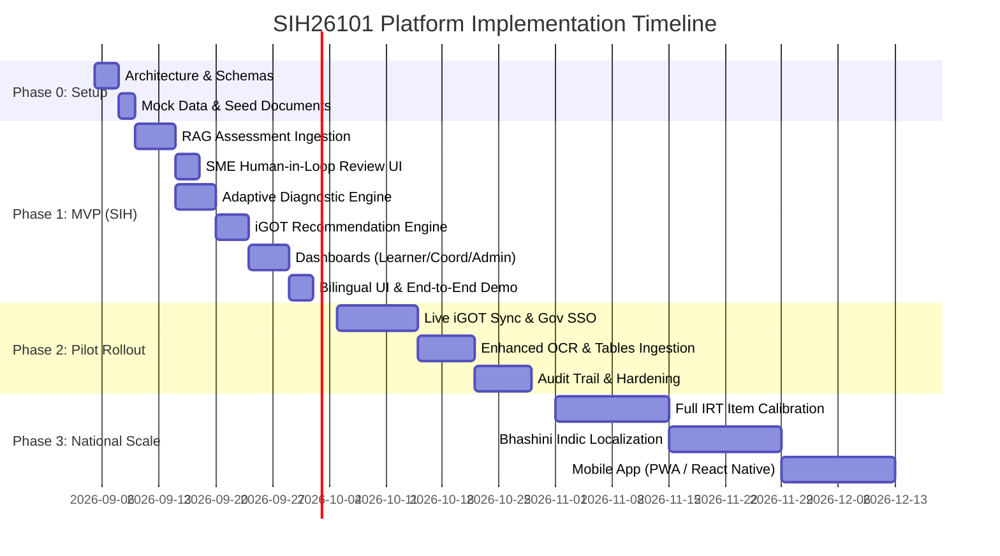

# Implementation Plan: AI-Enabled Adaptive Learning & Assessment Platform (SIH26101 - MoSPI)

## Executive Summary

This implementation plan provides an end-to-end, phased engineering roadmap for the **AI-Enabled Adaptive Learning & Assessment Platform for India's Official Statistical System (MoSPI)** (Problem Statement: **SIH26101**). 

The platform transforms static civil-service training into a dynamic, AI-powered continuous capacity-building pipeline. It features:
1. **Automated Document-to-Assessment RAG Pipeline** (MCQs, scenario-based quizzes, and case studies with traceable citations and confidence scores).
2. **Human-in-the-Loop SME Review Queue** for content validation and question bank lifecycle management.
3. **Adaptive Diagnostic Assessment Engine** (evaluating statistical officers across role-specific competency matrices).
4. **iGOT Karmayogi Integrated Recommendation Engine** (closing competency gaps with hyper-personalized course pathways).
5. **Multi-Tier Real-Time Analytics Dashboards** (Learner, Coordinator, SME Reviewer, and MoSPI HQ Institutional Admin).
6. **Bilingual (English/Hindi) & Accessible UI** compliant with WCAG 2.1 AA and MeitY security standards.

---

## 1. System Architecture & Tech Stack

```
┌────────────────────────────────────────────────────────────────────────────────────────┐
│                               Frontend Tier (Next.js 14 / React)                        │
│   ┌───────────────────┬──────────────────────┬────────────────────┬────────────────┐   │
│   │  Learner Portal   │ Coordinator Console  │ SME Review Queue   │ Admin HQ Heatmap│   │
│   └───────────────────┴──────────────────────┴────────────────────┴────────────────┘   │
│            i18n Localization (EN / HI)  •  Tailwind CSS  •  Shadcn/UI  •  Recharts     │
└───────────────────────────────────────────┬────────────────────────────────────────────┘
                                            │ HTTPS / REST / SSE
┌───────────────────────────────────────────▼────────────────────────────────────────────┐
│                             Backend API Layer (FastAPI / Python)                       │
│  ┌───────────────┬──────────────────┬──────────────────┬─────────────────────────────┐ │
│  │ Auth & RBAC   │ Diagnostic (CAT) │ Recommendation   │ Document Ingestion & RAG   │ │
│  │ (JWT / SSO)   │ Engine           │ Service          │ Pipeline (LangChain/Llama)  │ │
│  ├───────────────┼──────────────────┼──────────────────┼─────────────────────────────┤ │
│  │ SME Workflow  │ Analytics Engine │ iGOT Karmayogi   │ Notification & Audit        │ │
│  │ & Q-Bank Svc  │ & Report Export  │ Adapter Sync     │ Trail Logging               │ │
│  └───────────────┴──────────────────┴──────────────────┴─────────────────────────────┘ │
└──────────────┬──────────────────┬─────────────────┬───────────────────┬────────────────┘
               │                  │                 │                   │
    ┌──────────▼─────────┐ ┌──────▼───────┐ ┌───────▼─────────┐ ┌───────▼──────────────┐
    │ PostgreSQL +       │ │ Redis Cache  │ │ Vector Store    │ │ External Integrations│
    │ pgvector           │ │ (Sessions,   │ │ (ChromaDB /     │ │ • iGOT Karmayogi API │
    │ (Relational Data,  │ │ Rate Limiting│ │ Milvus / Qdrant)│ │ • Gov SSO (e.g. SAML)│
    │ Competencies, Logs)│ │ Celery Queue)│ │ Embeddings      │ │ • Email/SMS Gateway  │
    └────────────────────┘ └──────────────┘ └───────┬─────────┘ └──────────────────────┘
                                                    │
                                           ┌────────▼─────────┐
                                           │ LLM Inference    │
                                           │ Llama 3 / Mistral│
                                           │ / OpenAI / Claude│
                                           └──────────────────┘
```

### Technology Matrix
- **Frontend**: Next.js 14 (App Router), React 18, TypeScript, Tailwind CSS, Lucide Icons, Recharts / Nivo (Heatmaps & Radars), next-intl (Bilingual EN/HI).
- **Backend**: Python 3.11+, FastAPI (high-throughput async REST), Pydantic v2, Celery / Redis (background task processing).
- **AI & RAG Pipeline**: LangChain / LlamaIndex, `sentence-transformers/all-MiniLM-L6-v2` or `text-embedding-3-small`, PyPDF / Unstructured for document parsing.
- **LLM Engine**: API-driven (OpenAI/Anthropic/Groq for rapid prototyping) + Local/Sovereign adapter (Ollama/vLLM with Llama-3-8B-Instruct for government air-gapped/on-prem deployments).
- **Database & Storage**: PostgreSQL 16 (Relational state & RBAC), ChromaDB / pgvector (Vector embeddings), Redis 7 (Caching, active test session state).

---

## 2. Phase-Wise Implementation Roadmap



---

### Phase 0: Foundation, Architecture & Seed Datasets (Weeks 1)
**Goal:** Establish repository structure, database schemas, mock iGOT course catalogs, and sample statistical reference documents.

- [x] **Task 0.1: Project Scaffolding & CI/CD**
  - Setup Monorepo / Split Repo (`frontend/` and `backend/`).
  - Configure Docker Compose for local development (FastAPI, Next.js, PostgreSQL, ChromaDB, Redis).
- [x] **Task 0.2: Database Modeling (PostgreSQL)**
  - Users & Roles (`Learner`, `Coordinator`, `SME_Reviewer`, `MoSPI_Admin`, `System_Admin`).
  - Competency Taxonomy (Categories: e.g., *Survey Design, Sampling Theory, Index Numbers, National Accounts, R/Python for Statistics*).
  - Assessment Banks (Questions, Options, Citations, Confidence Scores, Review State: `PENDING_REVIEW`, `APPROVED`, `REJECTED`, `EDITED`).
  - Assessment Sessions & Item Responses (Item Difficulty, Response Correctness, Duration).
  - iGOT Course Catalog & User Enrollments/Completions.
- [x] **Task 0.3: Domain Datasets Curation**
  - Collect official MoSPI reference manuals (e.g., NSS 78th Round Instruction Manual, Periodic Labour Force Survey [PLFS] Guidelines, Annual Survey of Industries [ASI] Concepts).
  - Prepare synthetic iGOT Karmayogi course dataset matching statistical competencies.

---

### Phase 1: MVP Core Build (Hackathon Prototype) (Weeks 2–3)
**Goal:** Deliver complete, functional end-to-end platform demonstrating all primary PRD capabilities.

#### Milestone 1.1: Document Ingestion & RAG Generation Pipeline
- **Document Chunking & Embedding**:
  - Ingest PDF/DOCX manuals; extract text, chapter metadata, and section headers.
  - Chunk with semantic overlap (500–800 tokens) using RecursiveCharacterTextSplitter.
  - Index vectors in ChromaDB/pgvector tagged with metadata (`doc_title`, `chapter`, `page_number`).
- **LLM Assessment Generator**:
  - Prompt templates enforcing structured JSON output for:
    - **MCQs**: Question stem, 4 distractors, correct option index, in-depth explanation, difficulty rating (`Easy`, `Medium`, `Hard`), and competency tag.
    - **Scenario-Based Questions**: Practical field statistical problem scenarios.
    - **Case Studies**: Multi-part reasoning questions based on survey methodology.
  - Source Citation Grounding: Prompt requires exact reference quotes from the retrieved context.
  - Confidence & Hallucination Guardrail: Compute embedding similarity between generated question/answer and source chunks; flag low-confidence items (<0.72) for mandatory SME verification.

#### Milestone 1.2: SME Review Queue & Question Bank Lifecycle
- **SME Dashboard**:
  - Split-screen UI: Left panel displays generated question + metadata; Right panel displays source PDF snippet with highlighted citation.
  - Actions: One-click `Approve`, `Edit & Approve`, `Regenerate`, or `Reject`.
  - Batch publishing of approved questions into the live active diagnostic pool.

#### Milestone 1.3: Adaptive Diagnostic Assessment Engine
- **Adaptive Testing Logic (CAT-lite)**:
  - Learner starts with baseline medium-difficulty questions for each competency.
  - Dynamic branching: If answered correctly, difficulty increments ($D_{n+1} = D_n + 1$); if incorrect, difficulty drops with targeted diagnostic probing.
  - Calculates sub-scores (0–100%) across all competency pillars upon completion.
  - Generates individual **Skill-Gap Heatmap** showing baseline vs. role-required benchmarks (e.g., *Junior Statistical Officer* vs. *Senior Statistical Officer* thresholds).

#### Milestone 1.4: iGOT Karmayogi Course Recommendation Engine
- **Recommendation Matcher**:
  - Ranks iGOT courses based on deficit score: $\Delta \text{Gap} = \text{Target Proficiency} - \text{Assessed Proficiency}$.
  - Maps top gap areas to corresponding course tags.
  - Returns personalized learning pathway with estimated completion hours, difficulty, and direct link to iGOT module.
  - Provides Coordinator override functionality to manually assign mandated training.

#### Milestone 1.5: Multi-Role Dashboards & Bilingual Interface
- **Learner Portal**: Diagnostic test taking, radar chart of competency gaps, course roadmap, and re-test triggers.
- **Training Coordinator Console**: Cohort overview, department-wide skill gap summaries, bulk document upload, manual course assignments.
- **Institutional MoSPI HQ Dashboard**: National/State-level readiness heatmaps, division-level analytics, training ROI tracking, CSV/PDF export.
- **Bilingual i18n**: English/Hindi toggling for complete UI and assessment items.

---

### Phase 2: Pilot Implementation & Enterprise Integration (Month 2)
**Goal:** Enterprise hardening, live integration, and institutional pilot readiness.

- **Task 2.1: iGOT Karmayogi Live API Connector & Webhook Sync**
  - Implement bidirectional sync with iGOT course catalog APIs and xAPI/SCORM completion triggers.
  - Fallback offline catalog caching and retry queues.
- **Task 2.2: Advanced Document Processing**
  - Integrate OCR (Tesseract / PaddleOCR) for legacy scanned statistical circulars.
  - Table extraction for statistical formulas and sample calculation tables.
- **Task 2.3: Government SSO & Security Compliance**
  - Implement SAML 2.0 / OAuth2 integration with Jan Parichay / NIC SSO.
  - Role-based data redaction and AES-256 encryption at rest/transit per MeitY guidelines.
  - Immutable audit logs for all SME edits and question approvals.
- **Task 2.4: Automated Institutional Reporting**
  - Headless PDF generation (Weasyprint / Puppeteer) for MoSPI quarterly capacity-building reports.

---

### Phase 3: National Scale-Up & Advanced Intelligence (Months 3–6)
**Goal:** Nationwide rollout across Central, State, and District statistical cadres with deep AI enhancements.

- **Task 3.1: Full Item Response Theory (IRT) Psychometric Calibration**
  - Transition from heuristic CAT to 2PL/3PL IRT models.
  - Real-time parameter estimation ($\alpha$ discrimination, $\beta$ difficulty, $\gamma$ pseudo-guessing) based on national test-taker cohorts.
- **Task 3.2: Indic Language & Bhashini AI Integration**
  - Integrate Bhashini API for automated translation and voice-enabled learning in 10+ Indian official languages (Tamil, Telugu, Bengali, Marathi, etc.).
- **Task 3.3: Sovereign On-Prem LLM Deployment**
  - Fine-tune open-source models (e.g. Llama-3-70B / Sarvam Indic LLMs) on official MoSPI datasets for air-gapped deployment in MeghRaj / NIC cloud.
- **Task 3.4: Native Mobile App / PWA**
  - Mobile-first experience for field enumerators and district statistical staff with offline diagnostic caching.

---

## 3. Database Schema Blueprint

```sql
-- Core Competency Taxonomy
CREATE TABLE competencies (
    id UUID PRIMARY KEY DEFAULT gen_random_uuid(),
    code VARCHAR(50) UNIQUE NOT NULL, -- e.g. "STAT_SAMPLING_01"
    name VARCHAR(255) NOT NULL,
    category VARCHAR(100) NOT NULL, -- e.g. "Survey Methodology"
    description TEXT
);

-- Role Benchmarks
CREATE TABLE role_competency_targets (
    id UUID PRIMARY KEY DEFAULT gen_random_uuid(),
    role_name VARCHAR(100) NOT NULL, -- e.g. "Junior Statistical Officer"
    competency_id UUID REFERENCES competencies(id),
    target_proficiency INT NOT NULL -- 0 to 100 scale
);

-- Source Reference Documents
CREATE TABLE reference_documents (
    id UUID PRIMARY KEY DEFAULT gen_random_uuid(),
    title VARCHAR(255) NOT NULL,
    file_path TEXT NOT NULL,
    uploaded_by UUID REFERENCES users(id),
    status VARCHAR(50) DEFAULT 'PROCESSED',
    created_at TIMESTAMP WITH TIME ZONE DEFAULT NOW()
);

-- AI Generated Question Bank
CREATE TABLE questions (
    id UUID PRIMARY KEY DEFAULT gen_random_uuid(),
    document_id UUID REFERENCES reference_documents(id),
    competency_id UUID REFERENCES competencies(id),
    question_type VARCHAR(50) NOT NULL, -- 'MCQ', 'SCENARIO', 'CASE_STUDY'
    difficulty_level VARCHAR(20) NOT NULL, -- 'EASY', 'MEDIUM', 'HARD'
    stem TEXT NOT NULL,
    options JSONB, -- [{"id": 0, "text": "Option A"}, ...]
    correct_option_index INT NOT NULL,
    explanation TEXT NOT NULL,
    citation_text TEXT NOT NULL,
    page_number INT,
    confidence_score FLOAT NOT NULL,
    review_status VARCHAR(30) DEFAULT 'PENDING_REVIEW', -- 'APPROVED', 'REJECTED', 'EDITED'
    reviewed_by UUID REFERENCES users(id),
    created_at TIMESTAMP WITH TIME ZONE DEFAULT NOW()
);

-- Assessment Sessions & Response Logs
CREATE TABLE assessment_sessions (
    id UUID PRIMARY KEY DEFAULT gen_random_uuid(),
    user_id UUID REFERENCES users(id),
    session_type VARCHAR(50) NOT NULL, -- 'DIAGNOSTIC', 'POST_COURSE_EVAL'
    status VARCHAR(30) DEFAULT 'IN_PROGRESS',
    started_at TIMESTAMP WITH TIME ZONE DEFAULT NOW(),
    completed_at TIMESTAMP WITH TIME ZONE,
    final_scores JSONB -- {"STAT_SAMPLING_01": 78, "STAT_INDEX_02": 45}
);
```

---

## 4. API Endpoints Specification (FastAPI)

| Method | Endpoint | Description | Role |
|---|---|---|---|
| `POST` | `/api/v1/auth/login` | Authenticate user & issue JWT | Public |
| `POST` | `/api/v1/documents/upload` | Upload PDF & trigger async RAG vectorization | Coordinator, Admin |
| `POST` | `/api/v1/assessments/generate` | Trigger LLM question generation from indexed doc | Coordinator, SME |
| `GET` | `/api/v1/sme/review-queue` | Fetch unverified AI questions with source citations | SME Reviewer |
| `PUT` | `/api/v1/sme/questions/{id}` | Approve, edit, or reject question | SME Reviewer |
| `POST` | `/api/v1/diagnostic/start` | Initialize adaptive diagnostic session | Learner |
| `POST` | `/api/v1/diagnostic/submit-item` | Submit answer & retrieve next calibrated question | Learner |
| `GET` | `/api/v1/diagnostic/{id}/report` | Get detailed skill-gap breakdown & heatmaps | Learner, Coord |
| `GET` | `/api/v1/recommendations` | Get personalized iGOT course suggestions | Learner |
| `GET` | `/api/v1/analytics/institutional` | Aggregate national/state readiness metrics | MoSPI HQ Admin |

---

## 5. Verification & Testing Strategy

### 5.1 Automated Testing
- **Unit Tests**:
  - RAG prompt formatting and JSON parsing validation (`pytest`).
  - Adaptive difficulty algorithm unit tests (verify score escalation/de-escalation logic).
  - Recommendation engine ranking algorithm unit tests.
- **Integration Tests**:
  - End-to-end diagnostic session simulation (simulating 1,000 synthetic test runs to verify scoring stability).
  - Document ingestion → embedding → LLM generation → SME approval API chain.
- **RAG Triad & LLM Quality Evaluation**:
  - Context Relevance, Groundedness (Faithfulness), and Answer Relevance scored via automated RAG evaluation metrics.

### 5.2 User & SME Acceptance Testing
- **SME Review Usability**: Verification that SMEs can inspect citations and approve questions in < 45 seconds per question.
- **Multi-Role Flow Validation**: Verify RBAC isolation between Learner, Coordinator, SME, and MoSPI Admin.
- **Bilingual Validation**: Verify Hindi translations and UI layout consistency on desktop and mobile viewports.

---

## 6. Risk Matrix & Mitigations

| Risk | Severity | Probability | Mitigation Strategy |
|---|---|---|---|
| **LLM Hallucinations in Statistical Methods** | High | Medium | Strict RAG citation enforcement, groundness threshold gating (<0.72 requires manual review), and mandatory human SME sign-off. |
| **iGOT Karmayogi API Downtime / Delays** | Medium | Medium | Implement local course metadata cache + mock simulator adapter for seamless fallback. |
| **Cold Start for New Statistical Officers** | Low | High | Initial standardized baseline diagnostic test covering core foundational statistical competencies. |
| **Data Privacy of Sensitive Government Manuals** | High | Low | Support for sovereign/on-premise local LLMs (Llama-3 via vLLM/Ollama), zero external data retention policies. |
